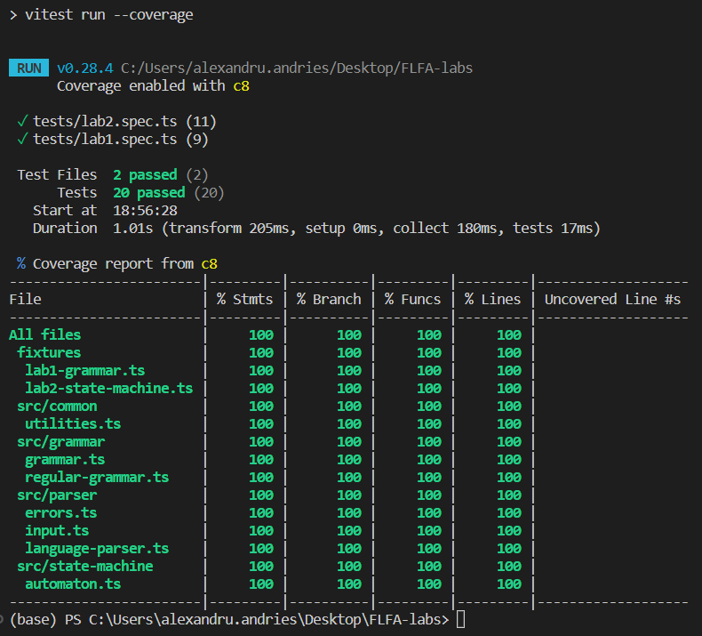
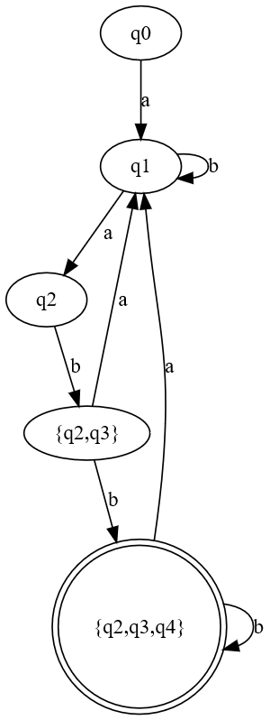

# Topic: Chomsky Normal Form

### Course: Formal Languages & Finite Automata

### Author: Andrieș Alexandru

---

## Theory

### NFA to DFA

WIP

## Objectives:

1.  Learn about Chomsky Normal Form (CNF).

2.  Get familiar with the approaches of normalizing a grammar.

3.  Implement a method for normalizing an input grammar by the rules of CNF.

    i. The implementation needs to be encapsulated in a method with an appropriate signature (also ideally in an appropriate class/type).

    ii. The implemented functionality needs executed and tested.

    iii. A BONUS point will be given for the student who will have unit tests that validate the functionality of the project.

    iv. Also, another BONUS point would be given if the student will make the aforementioned function to accept any grammar, not only the one from the student's variant.

## Implementation description

### Setup

This project is written in TypeScript and uses Vitest for testing. It has a github actions CI pipeline to run the tests, so the verification of the code is automated without having to clone the repository. All tests will be placed in the `./tests` folder and the specs are grouped by the laboratory for simplicity.

### Grammar

The grammar from the first laboratory is not a good fit for this one and I renamed it to `RegularGrammar` and created a new `Grammar` class that accepts multiple words for the left side of the production.

```ts
// src/grammar/grammar.ts
export type Production = {
  from: string[];
  to: string[];
};

export class Grammar {
  constructor(
    readonly start: string,
    readonly productions: Production[],
    readonly nonTerminal: string[],
    readonly terminal: string[],
  ) {}

  getClassification():
    | "regular"
    | "context-free"
    | "context-sensitive"
    | "recursive";
  private isRegular(): boolean;
  private isContextFree(): boolean;
  private isContextSensitive(): boolean;
}
```

The `getClassification` method is used to determine the type of grammar in Chomsky hierarchy according to point 2.a.

Here is a code snippet on one of the sub methods (it checks for both left to right and right to left regularity):

```ts
// src/grammar/grammar.ts
private isRegular(): boolean {
    const { nonTerminal, terminal } = this;

    return this.productions.every(({ from, to }) => {
      const isFromNonTerminal =
        from.length === 1 && nonTerminal.includes(from[0]);
      const isToRegularLeftToRight = to
        .slice(0, -1)
        .every((word) => terminal.includes(word));
      const isToRegularRightToLeft = to
        .slice(1)
        .every((word) => terminal.includes(word));

      return (
        isFromNonTerminal && (isToRegularLeftToRight || isToRegularRightToLeft)
      );
    });
  }
```

### Finite Automaton

Some foreshadowing, here are some utilities for formatting composite states:

```ts
// src/state-machine/automaton.ts
export type Transition = {
  readonly from: string;
  readonly to: string;
  readonly effect: string;
};

const formatCompositeState = (states: string[]): string => {
  if (states.length === 0) {
    return "";
  }
  if (states.length === 1) {
    return states[0];
  }
  return `{${states.join(",")}}`;
};

const unpackCompositeState = (state: string): string[] => {
  if (state.startsWith("{") && state.endsWith("}")) {
    return state.slice(1, -1).split(",");
  }
  return [state];
};
```

The `Automaton` class is initialized with a list of transitions, final states and the initial state. It's methods allow for checking if it's deterministic, converting it to a grammar, converting it to a DFA and serializing it into [Dot notation](<https://en.wikipedia.org/wiki/DOT_(graph_description_language)>) for visualization. The conversion to DFA method uses a queue to analyze the transitions row by row and creates a new `Automaton` instance.

```ts
// src/state-machine/automaton.ts
export class Automaton {
  private readonly _initialState: string;
  private readonly _states: string[];
  private readonly _effects: string[];
  private readonly _transitions: Transition[];
  private readonly _finalStates: string[];

  constructor(
    initialState: string,
    states: string[],
    transitions: Transition[],
    finalStates: string[],
  ) {
    this._initialState = initialState;
    this._states = states;
    this._transitions = transitions;
    this._finalStates = finalStates;

    this._effects = [...new Set(transitions.map((t) => t.effect))];
  }

  private transitionToProduction(transition: Transition): RegularProduction;
  toGrammar(): RegularGrammar;
  isDeterministic(): boolean;
  toDeterministic(): Automaton;
  serializeToDot(name = "automaton"): string;
}
```

## Conclusions / Screenshots / Results

### Conclusions & Results

In this laboratory work I learned how to implement programmatically the conversion of an NFA to DFA. I also learned how to determine the Chiomsky hierarchy of a grammar better by making an algorithm for that. For the visualization part, I learned and used the [Dot notation](<https://en.wikipedia.org/wiki/DOT_(graph_description_language)>) for the first time. Writing the conversion was not hard, as the language is very declarative and laconic. For the visualization i used a web implementation of the [Graphviz](https://graphviz.org/) library (run the demo to get a link).

The objectives of this laboratory were met and the unit tests are proof of that:



### Visualization

The visualization demo gives this output:

```powershell
(base) PS C:\Users\alexandru.andries\Desktop\FLFA-labs> pnpm run demo:graph

> flfa-labs@1.0.0 demo:graph C:\Users\alexandru.andries\Desktop\FLFA-labs
> ts-node demo/serialize-to-dot.ts -r tsconfig-paths/register

digraph NFA {
  "q0" -> "q1" [label = "a"]
  "q1" -> "q1" [label = "b"]
  "q1" -> "q2" [label = "a"]
  "q2" -> "q2" [label = "b"]
  "q2" -> "q3" [label = "b"]
  "q3" -> "q4" [label = "b"]
  "q3" -> "q1" [label = "a"]
  "q4" [shape = doublecircle]
}

digraph DFA {
  "q0" -> "q1" [label = "a"]
  "q1" -> "q2" [label = "a"]
  "q1" -> "q1" [label = "b"]
  "q2" -> "{q2,q3}" [label = "b"]
  "{q2,q3}" -> "q1" [label = "a"]
  "{q2,q3}" -> "{q2,q3,q4}" [label = "b"]
  "{q2,q3,q4}" -> "q1" [label = "a"]
  "{q2,q3,q4}" -> "{q2,q3,q4}" [label = "b"]
  "{q2,q3,q4}" [shape = doublecircle]
}
Show online: <long link>
```

The online visualization - [GraphvizOnline](https://dreampuf.github.io/GraphvizOnline/#digraph%20DFA%20%7B%0A%20%20%22q0%22%20-%3E%20%22q1%22%20%5Blabel%20%3D%20%22a%22%5D%0A%20%20%22q1%22%20-%3E%20%22q2%22%20%5Blabel%20%3D%20%22a%22%5D%0A%20%20%22q1%22%20-%3E%20%22q1%22%20%5Blabel%20%3D%20%22b%22%5D%0A%20%20%22q2%22%20-%3E%20%22%7Bq2%2Cq3%7D%22%20%5Blabel%20%3D%20%22b%22%5D%0A%20%20%22%7Bq2%2Cq3%7D%22%20-%3E%20%22q1%22%20%5Blabel%20%3D%20%22a%22%5D%0A%20%20%22%7Bq2%2Cq3%7D%22%20-%3E%20%22%7Bq2%2Cq3%2Cq4%7D%22%20%5Blabel%20%3D%20%22b%22%5D%0A%20%20%22%7Bq2%2Cq3%2Cq4%7D%22%20-%3E%20%22q1%22%20%5Blabel%20%3D%20%22a%22%5D%0A%20%20%22%7Bq2%2Cq3%2Cq4%7D%22%20-%3E%20%22%7Bq2%2Cq3%2Cq4%7D%22%20%5Blabel%20%3D%20%22b%22%5D%0A%20%20%22%7Bq2%2Cq3%2Cq4%7D%22%20%5Bshape%20%3D%20doublecircle%5D%0A%7D)

And a picture of the visualized DFA:



## References

1. Course material
2. [tutorialspoint - Chomsky classification](https://www.tutorialspoint.com/automata_theory/chomsky_classification_of_grammars.htm)
3. [Wikipedia - Dot notation](<https://en.wikipedia.org/wiki/DOT_(graph_description_language)>)
4. [Graphviz](https://graphviz.org)
